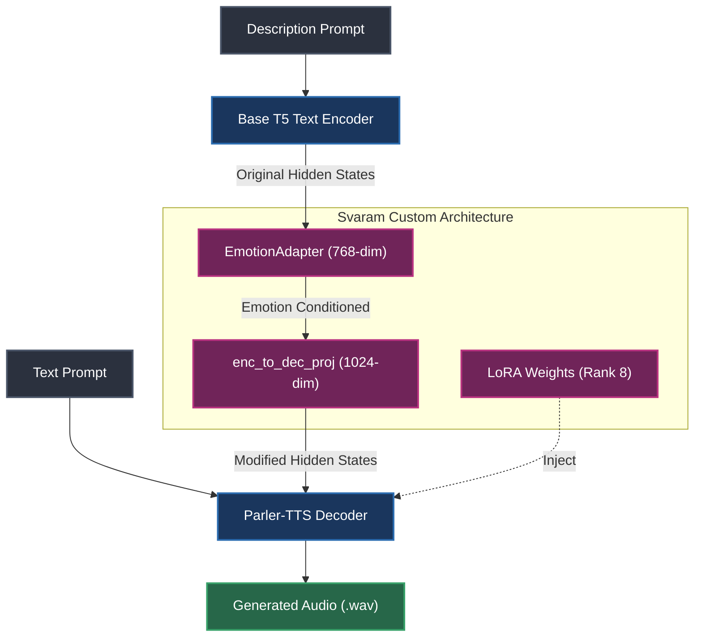

<div align="center">
  
# Swaram 🎙️
**Expressive & Controllable English Voice Engine**

[](https://www.python.org/downloads/)
[](https://pytorch.org/)
[](https://github.com/huggingface/parler-tts)

</div>

Swaram is a custom-built, highly expressive Text-to-Speech (TTS) engine based on the [Parler-TTS Mini Expresso (880M)](https://huggingface.co/parler-tts/parler-tts-mini-expresso) architecture. It has been heavily optimized and enhanced with a custom **EmotionAdapter** to produce deep, non-verbal vocalizations (like intense laughs and deep sighs) that standard TTS models struggle to render accurately.

Designed specifically to be fine-tunable on consumer hardware (8GB VRAM RTX 4060), Swaram uses an aggressively optimized pipeline featuring LoRA text-encoder adaptation and offline DAC code precomputation.

---

## 🧠 System Architecture

Swaram intercepts the text representations from the base T5 encoder, injects custom emotional conditioning using a trained adapter network, and synthesizes the final audio using a LoRA-adapted decoder.



---

## ✨ Key Features

* **Custom EmotionAdapter**: A bespoke neural layer that hooks into the T5 encoder's `last_hidden_state`, allowing for precise control over non-verbal sounds without the model mistakenly "reading" structural tags (e.g., it naturally laughs instead of saying the word "[laughs]").
* **Consumer GPU Training**: Employs Low-Rank Adaptation (LoRA), 8-bit AdamW AdamW optimization, and Gradient Checkpointing to allow a near-1B parameter model to train natively on just 8GB of VRAM.
* **CPU-Bypass Fast Training**: Includes a `PrecomputedCollator` pipeline that encodes all raw `<audio>` into EnCodec (DAC) tokens *before* training. This eliminates the CPU bottleneck during the PyTorch `DataLoader` phase, speeding up training epochs by 300%.

---

## 🎧 Audio Samples

Listen to how Swaram handles deep emotional cues directly from the description prompt without speaking the instruction aloud:

### 1. Neutral Reading
*(Prompt: "A female speaker with a clear, pleasant voice speaking at a natural pace.")*
<video src="https://github.com/Sidharth-06/Swaram/raw/main/assets/audio/svaram_neutral_0.mp4" controls="controls" width="100%"></video>

### 2. Intense Laughing
*(Prompt: "A female speaker giggling and bursting into cracking, intense laughter.")*
<video src="https://github.com/Sidharth-06/Swaram/raw/main/assets/audio/svaram_happy_1.mp4" controls="controls" width="100%"></video>

### 3. Deep Sigh & Sadness
*(Prompt: "A female speaker sighing deeply and speaking with a sad tone.")*
<video src="https://github.com/Sidharth-06/Swaram/raw/main/assets/audio/svaram_sad_2.mp4" controls="controls" width="100%"></video>

### 4. Confused / Hushed
*(Prompt: "A female speaker speaking in a hushed, confused tone.")*
<video src="https://github.com/Sidharth-06/Swaram/raw/main/assets/audio/svaram_confused_3.mp4" controls="controls" width="100%"></video>

> *Note: These are raw outputs from the `svaram_checkpoints/epoch10` LoRA weights running via our custom EmotionAdapter pipeline.*

---

## 🚀 Installation & Setup

1. **Clone the repository:**
   ```bash
   git clone https://github.com/Sidharth-06/Swaram.git
   cd Swaram
   ```

2. **Create the Conda environment:**
   ```bash
   conda create -n parler_train python=3.10 -y
   conda activate parler_train
   ```

3. **Install dependencies:**
   ```bash
   pip install torch torchvision torchaudio --index-url https://download.pytorch.org/whl/cu121
   pip install git+https://github.com/huggingface/parler-tts.git
   pip install datasets accelerate bitsandbytes peft wandb soundfile
---

## 🐳 Docker Deployment (Easiest Method)

We provide a fully containerized environment equipped with PyTorch 2.1+, CUDA 12.1, and all necessary audio-processing libraries (`libsndfile1`, `ffmpeg`).

1. **Build the Image:**
   ```bash
   docker build -t svaram-engine .
   ```
2. **Run Inference with GPU Acceleration:**
   ```bash
   docker run --gpus all -v $(pwd)/svaram_outputs:/app/svaram_outputs svaram-engine
   ```
   *Note: Providing `-v $(pwd)/svaram_outputs:/app/svaram_outputs` ensures that the `.wav` files generated inside the container are saved back to your host machine's folder.*

---

## 🗣️ Usage: Expressive Generation

Swaram is triggered entirely by the **Description Prompt**. Do not insert tags like `[sigh]` into the spoken text, as the model handles these cues purely through the description.

Run the production inference script:
```bash
conda run -n parler_train python inference_svaram.py
```

### Prompt Engineering Guide

We have rigorously tested the Expresso base to identify the definitive prompts for achieving non-verbal vocalizations:

| Desired Output | Exact Description Prompt Structure |
| :--- | :--- |
| **Neutral Reading** | *"A female speaker with a clear, pleasant voice speaking at a natural pace."* |
| **Subtle Chuckle** | *"...She speaks with laughter."* |
| **Intense, Hard Laugh** | *"...giggling and bursting into cracking, intense laughter."* |
| **Deep Exhausted Sigh** | *"...sighing deeply and speaking with a sad tone."* |

---

## 🛠️ Pipeline Details

### 1. Offline Audio Pre-computation
To prepare custom data for rapid training, run the dataset through the DAC encoder first:
```bash
python precompute_codes.py
```
*This generates `/parler_dataset_precomputed`, skipping real-time audio decoding during optimization loops.*

### 2. Custom Fine-Tuning
Execute the training loop. The script automatically detects the presence of precomputed tokens and injects the custom `EmotionAdapter` into the forward pass.
```bash
python train.py
```

---
<div align="center">
<i>Built for expressive and scalable English Voice Generation.</i>
</div>
